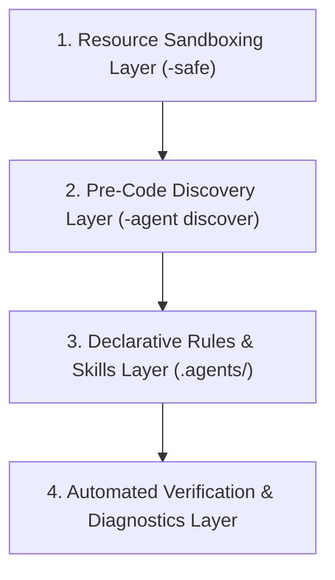

# Prolog Agent Toolkit

**Version**: `0.0.1.dev14`  
**Category**: AI Assistant Developer Tools / Prolog Language Tooling  
**Metadata**: [schema.org.jsonld](schema.org.jsonld)

A reusable AI agent skills, coding standards, and multi-engine (Scryer, SWI, Trealla, Tau) safety execution toolkit for Prolog.

> [!NOTE]
> **Project Status: Active Development**  
> This toolkit is fully usable today for sandboxed Prolog execution, project scaffolding, library discovery, and guiding AI assistants. However, it remains under **active development**.
>
> This project is currently hosted in the original Architect's GitHub repository. If there is sufficient interest to build a community of users, it likely will be moved to a [GitHub Organization](https://docs.github.com/en/organizations/collaborating-with-groups-in-organizations/about-organizations) so the project is not dependent on one person reviewing Pull Requests.
>
> If you have ideas, feedback, feature suggestions, or want to contribute, please see [`CONTRIBUTING.md`](file:///home/doug/code/prolog-agent-toolkit/CONTRIBUTING.md)!

---

> ### 🤖 AI Agent Navigation Quick Start
> Entering this repository as an AI agent (Google Antigravity, Claude Code, Cursor, Windsurf, Copilot, or Emacs AI tools)?
> Key features: reusable agent skills (`.agents/skills/`), Prolog purity standards (`if_/3`, `dif/2`), library discovery (`prolog-agent discover`), and multi-engine safety execution.
> - **Navigation Blueprint & Top 10 Q&A**: Read [`AGENT_GUIDE.md`](file:///home/doug/code/prolog-agent-toolkit/AGENT_GUIDE.md)
> - **Coding & Purity Standards**: Inspect [`AGENTS.md`](file:///home/doug/code/prolog-agent-toolkit/AGENTS.md) and `.agents/skills/`
> - **Library Discovery Protocol**: See `prolog-library-discovery` skill or run `prolog-agent discover`
> - **Directory & File Map**: Inspect [`AGENT_INDEX.json`](file:///home/doug/code/prolog-agent-toolkit/AGENT_INDEX.json)
> - **Component Ontology**: Inspect [`docs/repository_ontology.json`](file:///home/doug/code/prolog-agent-toolkit/docs/repository_ontology.json)
> - **Capability Manifest**: Inspect [`docs/capability_manifest.json`](file:///home/doug/code/prolog-agent-toolkit/docs/capability_manifest.json)
> - **Terminology & Glossary**: Read [`docs/GLOSSARY.md`](file:///home/doug/code/prolog-agent-toolkit/docs/GLOSSARY.md)
> - **Anti-Patterns & Reuse**: Read [`docs/ANTI_PATTERNS.md`](file:///home/doug/code/prolog-agent-toolkit/docs/ANTI_PATTERNS.md)

---


| Category | Supported Technologies / Systems |
|---|---|
| **AI Assistants & IDEs** | Google Antigravity (AGY), Claude Code (Anthropic), GitHub Copilot, Cursor, Windsurf, Emacs AI (`aidermacs`, `agent-shell`, `gptel`) |
| **Prolog Engines** | Scryer Prolog (ISO Default), SWI-Prolog, Trealla Prolog, Tau Prolog, GNU Prolog, Ciao Prolog |
| **Language Standards** | ISO Prolog, Definite Clause Grammars (DCG), CLP(Z) Constraints, Reification (`reif`) |
| **Agent Capabilities** | Execution Sandboxing, `testing.pl` Unit Testing, `bakage` Manifests, Multi-file Release Versioning |

---

## Features

- **Cross-Platform Safety Wrappers**: Runs Prolog engines safely with execution timeouts, low CPU priority, and memory limits across Linux, macOS, BSD, and Windows.
- **CLI Management Suite**: Project bootstrapping, module generator, dialect switcher, release manager, and skill validator via `prolog-agent`.
- **Dialect-Aware Standards**: Enforces ISO Scryer, SWI, Trealla, Tau, and portable Prolog conventions automatically.
- **Autonomous AI Subagents**: Pre-configured subagents for purity auditing, automated refactoring, unit test generation, benchmark running, and security scanning.

---

## CLI Reference Summary

| Command | Purpose |
|---|---|
| `prolog-agent init <name> [--dialect scryer\|swi\|trealla\|tau\|iso]` | Scaffolds a new project with `src/`, `tests/`, manifests (`bakage.toml`/`pack.pl`), and starter module. |
| `prolog-agent template <name> [--dialect ...]` | Generates a project template for specified dialect. |
| `prolog-agent module <name> [--dialect ...]` | Scaffolds a single pure Prolog module with Covington doc headers. |
| `prolog-agent init-script` | Generates shell environment configuration script. |
| `prolog-agent release [--version X.Y.Z]` | Synchronizes versions across project manifests and creates release tags. |
| `prolog-agent check-version` | Audits version parity across manifest files (`pyproject.toml`, `bakage.toml`, `pack.pl`, `README.md`). |
| `prolog-agent install-hooks [--hook-type ...]` | Installs executable Git pre-commit / pre-push hooks to enforce version parity and skill validation. |
| `prolog-agent list-subagents` | Lists available autonomous subagents in `.agents/agents/`. |
| `prolog-agent validate-skills` | Validates `.agents/skills` integrity and frontmatter structure. |
| `scryer-safe [args...]` | Runs Scryer Prolog under safety timeout and memory limits. |
| `swi-safe [args...]` | Runs SWI-Prolog under safety limits. |
| `trealla-safe [args...]` | Runs Trealla Prolog under safety limits. |
| `tau-safe [args...]` | Runs Tau Prolog under safety limits. |
| `prolog-safe [args...]` | Multi-engine generic safety runner (selected via `PROLOG_ENGINE`). |

---

## Installation & Setup

### 1. Prerequisites
- **Python Package Manager**: [`uv`](https://github.com/astral-sh/uv) (recommended for tool isolation and high performance).
- **Target Prolog Engines**: At least one supported Prolog interpreter installed on system `PATH`:
  - **Scryer Prolog**: `scryer-prolog`
  - **SWI-Prolog**: `swipl`
  - **Trealla Prolog**: `tpl`
  - **Tau Prolog**: `tau-prolog` or Node.js runtime

### 2. Install CLI Tools with `uv`

Install `prolog-agent-toolkit` using `uv tool` to make `prolog-agent`, `scryer-safe`, `swi-safe`, `trealla-safe`, `tau-safe`, and `prolog-safe` globally available on your system `PATH`.

> [!IMPORTANT]
> You **must** run the `uv tool install` command from the **root directory** of the cloned `prolog-agent-toolkit` repository:

```bash
# Must be executed inside the prolog-agent-toolkit repository root directory:
harry@hogwarts:~/code/prolog-agent-toolkit$ uv tool install . --force
Resolved 2 packages in 3ms
Installed 6 executables: prolog-agent, prolog-safe, scryer-safe, swi-safe, tau-safe, trealla-safe

# Or run directly without permanent installation:
harry@hogwarts:~/code/prolog-agent-toolkit$ uv tool run prolog-agent --help
```

Verify installation:
```bash
scryer-safe --help
prolog-agent --help
```

---

### 3. Integrating Agent Rules & Skills with AI Assistants

To ensure rules and skills **never get clobbered or overwritten** when updating or working inside target repositories, choose one of the following methods:

#### Option A: Symlink into Target Project (Recommended for Team & Project Scope)
Symlinking connects your project root directly to `prolog-agent-toolkit`. Updating the toolkit automatically updates all linked projects without file conflicts:

```bash
# Inside your target Prolog project root:
ln -s /path/to/prolog-agent-toolkit/.agents .agents
ln -s .agents/AGENTS.md AGENTS.md
```

#### Option B: Custom Search Paths via `skills.json` (Recommended for Personal Setup)
Google Antigravity automatically loads rules and skills from both **Global Root** (`~/.gemini/config`) and **Workspace Root** (`.agents`).

To load skills globally across all projects on your machine without copying files, create `~/.gemini/config/skills.json` (or `.agents/skills.json` for workspace-level search paths):

```json
{
  "entries": [
    { "path": "/path/to/prolog-agent-toolkit/.agents/skills" }
  ],
  "inherits": [],
  "exclude": []
}
```

---

## Quickstart: Starting a New Prolog Project

Follow this guide to create and develop a brand new Prolog project with AI assistance:

### Step 1: Scaffold the Project
Run `prolog-agent init` specifying your project name and target Prolog engine (default is `scryer`):

```bash
prolog-agent init my_parser --dialect scryer
cd my_parser
```

### Step 2: Project Layout Overview
The project is bootstrapped with a clean structure, multi-dialect adapter support, standard testing framework, package manifests, and AI rules:

```text
my_parser/
├── bakage.toml          # Scryer Prolog manifest
├── pack.pl              # ISO / SWI manifest fallback
├── package.json         # Tau Prolog / npm manifest (optional)
├── AGENTS.md            # AI assistant rules & dialect guidelines
├── src/
│   ├── core/            # 100% Pure ISO Prolog core (dialect-agnostic)
│   │   └── logic.pl
│   ├── adapters/        # Dialect compatibility shims (scryer, swi, trealla, tau)
│   └── my_parser.pl     # Starter module with Covington doc block & DCG/CLP(Z) stubs
└── tests/
    ├── portable/        # Engine-agnostic ISO unit tests
    └── testing.pl       # Scryer testing.pl unit test harness
```

### Step 3: Run Immediate Smoke Tests
Execute tests safely using the engine's safety runner:

```bash
scryer-safe -g "use_module(tests/testing), run_tests, halt."
```

### Step 4: Develop with your AI Assistant
Open the project directory in Google Antigravity, Claude Code, Cursor, Copilot, or Emacs (`aidermacs`/`agent-shell`). The AI assistant automatically detects `.agents/AGENTS.md` and applies pure ISO Prolog guidelines.

**Example Starter Prompts**:
- *"Implement a pure DCG parser in `src/my_parser.pl` to parse JSON tokens using `library(charsio)` and `library(reif)`."*
- *"Add unit tests in `tests/testing.pl` for `parse_json/2`."*

---

## Quickstart: Working with an Existing Prolog Project

Follow this guide to bring safety sandboxing, linting, and autonomous subagents to an existing Prolog codebase:

### Step 1: Adopt Agent Rules into Existing Repository
In your existing project root, link or copy `.agents`:

```bash
cd /path/to/my-existing-prolog-repo

# Link .agents and AGENTS.md
ln -s /path/to/prolog-agent-toolkit/.agents .agents
ln -s .agents/AGENTS.md AGENTS.md
```

### Step 2: Select the Target Engine Dialect
Set the target engine environment variable for your terminal and safety runners:

```bash
# For SWI-Prolog base project:
export PROLOG_ENGINE=swi

# For Scryer Prolog base project:
export PROLOG_ENGINE=scryer
```

### Step 3: Use Autonomous Subagents on Existing Code
Ask your AI assistant to audit, refactor, or test existing modules using the built-in subagents in `.agents/agents/`:

* **Code Purity & Covington Style Audit**:
  > *"Audit `src/legacy_module.pl` using `prolog-purity-reviewer-agent` and report non-logical cuts or defaulty representations."*
* **Imperative to Pure ISO Refactoring**:
  > *"Refactor `cut_heavy_predicate/3` in `src/legacy_module.pl` to pure `if_/3` and `dif/2` using `prolog-refactor-agent`."*
* **Generate Unit Test Suite**:
  > *"Generate a unit test suite for `src/parser.pl` using `prolog-test-generator-agent`."*
* **Multi-Engine Portability Check**:
  > *"Check if `src/utils.pl` runs across both Scryer and SWI using `prolog-portability-reviewer-agent`."*

### Step 4: Run Tests & CI/CD Integration
Run your existing tests safely under memory and timeout guards:

```bash
# For SWI-Prolog test suite:
swi-safe -g "run_tests, halt."

# For custom command under generic runner:
PROLOG_TIMEOUT=15s PROLOG_MEMORY_MAX=200M prolog-safe -g "main, halt."
```

---

## Developer Workflow Flexibility: Packaged/Tested Projects vs. Lightweight REPL & Scratch Use Cases

`prolog-agent-toolkit` provides scaffolding for structured, package-based projects with unit test suites (`src/`, `tests/`, `bakage.toml`/`pack.pl`), but **you are not forced to write tests or package manifests**.

### Why the Toolkit Defaults to Tests & Package Manifests
1. **Automated AI Verification**: AI coding assistants (Google Antigravity, Claude Code, Cursor, Copilot) perform best when an automated test runner (`testing.pl`, `plunit`) is available to empirically verify that generated logic works cleanly without choice-point leaks or syntax errors.
2. **Reproducible Distribution**: Manifest files (`bakage.toml`, `pack.pl`, `package.json`) explicitly record module dependencies so projects can be published, installed, and shared across Prolog package managers.

### Workarounds for Lightweight, Non-Packaged, or Test-Free Use Cases

If you do not want a formal package structure or test suite (e.g. playing in the top-level REPL, writing quick logic puzzles, single-file scripts, or classroom learning), use one of these lightweight alternatives:

#### 1. Interactive REPL / Top-Level Exploration (No project, no tests, no manifest)
Launch an interactive top-level REPL safely from any terminal directory without creating any files, folders, manifests, or test suites:
```bash
scryer-safe    # Interactive Scryer Prolog top-level REPL with resource caps
swi-safe       # Interactive SWI-Prolog top-level REPL
trealla-safe   # Interactive Trealla Prolog top-level REPL
```
Use the top-level to query goals, test unification, and experiment interactively with CPU/RAM safety limits protecting your OS from infinite loops.

#### 2. Standalone Single-File & Scratch Scripting
Create single `.pl` files anywhere without scaffolding a full directory layout:
```bash
# Generate a single standalone module with Covington doc headers:
prolog-agent module scratch

# Run any standalone file safely:
scryer-safe scratch.pl
scryer-safe -g "hello(M), write(M), nl, halt." scratch.pl
```

#### 3. Stripped / Minimal Repositories
If you scaffold a project using `prolog-agent init my_app`, you can safely delete the `tests/` directory or `bakage.toml`/`pack.pl` manifest files if your project does not need automated testing or package distribution. The safety runners (`scryer-safe`, `swi-safe`, `prolog-safe`) execute code independently of any project layout or test harness.

---

## Standard Prolog Folder Architecture & Multi-Dialect Layout

When organizing Prolog software—especially repositories supporting multiple package managers (`bakage`, `pack_install`, `npm`) or multiple dialects (Scryer, SWI, Trealla, Tau)—adhere to the following canonical layout:

```text
my_prolog_project/
├── .agents/                        # AI Assistant rules & skill references (symlink or dir)
│   ├── AGENTS.md                   # Project rules & dialect conventions
│   └── skills/                     # Engine & tool skills
├── src/                            # Source Code Directory
│   ├── core/                       # 100% Pure ISO Prolog Core (dialect-agnostic)
│   │   ├── logic.pl                # Pure DCGs, term relations, CLP constraints
│   │   └── types.pl                # Functor data representations
│   ├── adapters/                   # Dialect Shims & Library Normalization
│   │   ├── scryer/compat.pl        # Imports library(charsio), library(reif), library(clpz)
│   │   ├── swi/compat.pl           # Imports library(clpfd), plunit, SWI shims
│   │   ├── trealla/compat.pl       # Trealla ISO imports & FFI
│   │   └── tau/compat.pl           # Tau DOM & JS interoperability hooks
│   └── my_prolog_project.pl        # Main module entry point
├── tests/                          # Test Suites Directory
│   ├── portable/                   # Engine-Agnostic ISO Test Assertions
│   │   └── test_core.pl            # Pure goal assertions (must_succeed/1)
│   ├── scryer/                     # Scryer Prolog Test Harness
│   │   └── test_scryer.pl          # Uses library(testing) / testing.pl
│   ├── swi/                        # SWI-Prolog Test Harness
│   │   └── test_swi.pl             # Uses library(plunit)
│   └── js/                         # Tau Prolog JS Integration Tests
│       └── test_tau.test.js        # Jest / Vitest harness
├── bakage.toml                     # Scryer Prolog bakage manifest
├── pack.pl                         # SWI-Prolog pack manifest & Scryer fallback
├── package.json                    # Tau Prolog / npm manifest (optional)
├── AGENTS.md                       # Workspace root AI agent instructions
├── README.md                       # Human-facing project documentation
├── CHANGELOG.md                    # Release history
└── LICENSE                         # Open-source license
```

### Key Architectural Principles

1. **Multi-Manifest Co-existence**: Package manifests (`bakage.toml`, `pack.pl`, `package.json`, `pyproject.toml`) have distinct filenames and co-exist at the repository root without conflict. This allows publishing the project across multiple ecosystems simultaneously.
2. **Core vs. Adapter Decoupling**:
   - `src/core/`: Contains 100% pure ISO Prolog (pure DCGs, `dif/2`, reified `if_/3`). Free of engine-specific imports or extensions.
   - `src/adapters/`: Contains thin engine-specific compatibility shims that normalize dialect variations (`library(clpz)` vs `library(clpfd)`).
3. **Multi-Runner Test Hierarchy**:
   - `tests/portable/`: Pure goal assertions executable on any ISO engine.
   - `tests/scryer/`: Scryer unit tests using `library(testing)`.
   - `tests/swi/`: SWI-Prolog unit tests using `library(plunit)`.
   - `tests/js/`: JavaScript integration tests querying Tau Prolog via Node.js test runners.

---

## Safety Sandboxing & Runtime Flags

Control safety thresholds dynamically using environment variables:

```bash
# Set custom execution timeout and memory cap
PROLOG_TIMEOUT=10s PROLOG_MEMORY_MAX=128M scryer-safe -g "my_pred, halt."

# Run SWI-Prolog under safe wrapper
swi-safe -g "writeln('SWI Safe Mode'), halt."

# Switch engine dynamically
PROLOG_ENGINE=trealla prolog-safe -g "write('Hello Trealla'), nl, halt."
```

---

## Onboarding an Additional Prolog System

To add support for a new Prolog engine or dialect target (such as GNU Prolog, Ciao, ECLiPSe, B-Prolog, Ichiban, or YAP) to the toolkit, use the interactive **Engine Onboarding Workflow**:

```
.agents/skills/prolog-engine-onboarding/SKILL.md
```

Prompt your AI assistant to start the interactive onboarding process:

> *"Use `prolog-engine-onboarding` skill to guide me through adding support for GNU Prolog (gprolog) to this toolkit."*

### Onboarding Steps Summary

The interactive workflow guides you through 6 iterative phases:

1. **Information Gathering**: Collects CLI binary names (`gprolog`, `ciao`, `yap`), ISO compliance status, string representations (`chars`/`codes`/`string`), import syntax, and runner flags.
2. **Dialect Standards & Cheat Sheet Creation**: Generates `.agents/skills/<engine>-prolog-standards/SKILL.md` containing explicit `:- use_module(library(...)).` headers, exported predicate tables, and dialect autoload rules.
3. **Safety Runner & CLI Entry Point**: Updates `runner.py`, `cli.py`, and `pyproject.toml` to register `<engine>-safe`.
4. **Project Initializer & Scaffolding**: Updates `prolog-agent init` and `prolog-agent template` options for `--dialect <engine>`.
5. **Metadata & Agent Rules**: Updates `.agents/AGENTS.md`, `README.md`, `schema.org.jsonld`, and `pyproject.toml`.
6. **Automated Verification & Review**: Runs unit tests (`pytest`) and skill validation (`prolog-agent validate-skills`), asking clarifying questions iteratively until you confirm onboarding is complete.

---

## Programmer Guidelines: Working with AI for Prolog

For full guidelines, see [.agents/references/programmer_guidelines.md](.agents/references/programmer_guidelines.md).

When working with AI coding assistants (Google Antigravity, Claude Code, Cursor, Copilot, Emacs `aidermacs`/`gptel`) on Prolog software:

1. **Provide Semantics & AST Shapes, Not Logic Invention**: Give the AI module skeletons, AST constructors, and type invariants instead of asking it to invent relations from scratch.
2. **Specify Mode & Determinism Contracts Explicitly**: State input/output modes (`+`/`-`) and determinism requirements (`det`, `semidet` fail cleanly, `nondet` backtracking).
3. **Use Test-First Prompting**: Provide expected test cases (`testing.pl`, `plunit`, or test runner) first, then request code satisfying those tests.
4. **Enforce the Declarative Mindset**: Explicitly prompt: *"Do not use imperative reasoning. Use declarative reasoning based on unification, constraints, and backtracking."*
5. **Delegate DCG & Structural Boilerplate**: Let AI handle grammar production rules, AST building, and string formatting.
6. **Use AI for Refactoring & Choice-Point Audits**: Ask AI to identify choice points, make code tail-recursive, or transform cut-heavy logic into pure forms (`dif/2`, `if_/3`).

---

## Applying this Architectural Pattern to Other Programming Languages

While `prolog-agent-toolkit` is tailored specifically for multi-engine Prolog software, its underlying **4-layer architectural blueprint** can serve as inspiration for developers wanting to build similar AI-agent toolkits for other programming language ecosystems (such as Lisp, Erlang, Elixir, Scheme, Haskell, Python, Rust, or C++):



### The 4-Layer Agent Toolkit Blueprint

1. **Resource Sandboxing Layer (`<lang>-safe`)**:
   - A lightweight execution wrapper around the language runtime (REPL or script runner) enforcing CPU timeouts, RAM caps, and execution priority to protect host environments when AI agents execute untrusted code.
2. **Pre-Code-Generation Discovery Layer (`<lang>-agent discover`)**:
   - A CLI/API mechanism that queries installed modules, standard libraries, and package manifests before code generation so AI assistants reuse built-in capabilities instead of writing custom code.
3. **Declarative Rules & Skills Layer (`.agents/`)**:
   - A vendor-neutral `.agents/` folder containing root `AGENTS.md` steering rules, language dialect cheat sheets, and subagent workflow guidelines compatible across any AI coding assistant.
4. **Automated Verification & Diagnostics Layer**:
   - Automated syntax checkers, linters, and test runners (`testing.pl`, `pytest`, `cargo check`, `hlint`) that provide immediate empirical feedback to the AI assistant to confirm code correctness.

---

## Release & Versioning Workflow

- **Canonical Version Source**: `pyproject.toml` is the canonical version source of truth.
- **Synchronize Releases**: Run `prolog-agent release [--version X.Y.Z]` to synchronize `pyproject.toml`, `bakage.toml`, `pack.pl`, `README.md`, and `CHANGELOG.md`.
- **Git Tagging**: Official releases match Git annotated tags (e.g., `v0.0.1`).

---

## Contributing

We welcome contributions! Please see [CONTRIBUTING.md](CONTRIBUTING.md) for development setup, testing guidelines, pull request workflows, and the checklist for onboarding new Prolog engines.

