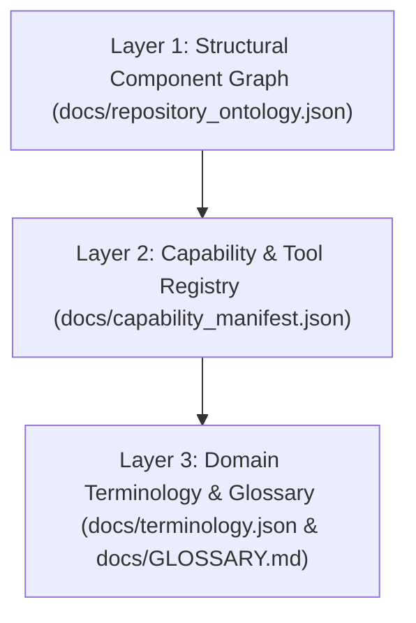
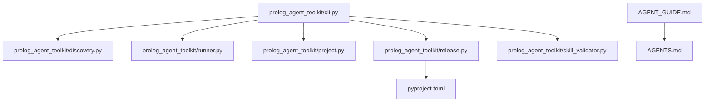

# Repository Ontology & Information Architecture

> **Version**: `0.0.1.dev12`  
> **Last Updated**: `2026-08-28`  
> **Machine-Readable Graph**: [`docs/repository_ontology.json`](repository_ontology.json)  
> **Capability Registry**: [`docs/capability_manifest.json`](capability_manifest.json)  
> **Terminology Index**: [`docs/terminology.json`](terminology.json)

The **Prolog Agent Toolkit Repository Ontology** is a machine-readable and human-readable structural model defining all core components, CLI entry points, execution safety layers, agent skills, autonomous subagents, and their directed relationships.

---

## 1. Overview & Purpose

In AI-native software engineering, an **ontology** serves as a deterministic map for both AI coding assistants (Google Antigravity, Claude Code, Cursor, Copilot, Emacs AI tools) and human contributors:

1. **Token Efficiency**: Instead of scanning hundreds of source files, AI assistants read the ontology and file map in milliseconds to instantly identify component responsibilities.
2. **Zero-Hallucination Navigation**: Prevents AI assistants from inventing non-existent CLI flags, placing files in wrong directories, or breaking version synchronization workflows.
3. **Vendor Neutrality**: Authored in standard Markdown and JSON Schema (`draft/2020-12`), ensuring zero vendor or IDE lock-in.

---

## 2. The 3-Layer Ontology Architecture

### Layer 1: Structural Component Graph ([`repository_ontology.json`](repository_ontology.json))
Maps repository files as **nodes** and their interactions as directed **edges**:

#### Core Node Categories:
- `build_system`: [`pyproject.toml`](../pyproject.toml) — Canonical version source of truth.
- `steering`: [`AGENTS.md`](../.agents/AGENTS.md) — Universal Prolog purity and agent steering rules.
- `onboarding`: [`AGENT_GUIDE.md`](../AGENT_GUIDE.md) — Agent navigation blueprint and top Q&A.
- `execution_safety`: [`prolog_agent_toolkit/runner.py`](../prolog_agent_toolkit/runner.py) — Resource-capped process sandboxing (`prolog-safe`, `scryer-safe`, etc.).
- `cli`: [`prolog_agent_toolkit/cli.py`](../prolog_agent_toolkit/cli.py) — CLI subcommand dispatcher.
- `scaffolding`: [`prolog_agent_toolkit/project.py`](../prolog_agent_toolkit/project.py) — Project initializer and module generator.
- `discovery`: [`prolog_agent_toolkit/discovery.py`](../prolog_agent_toolkit/discovery.py) — Pre-code-generation library discovery engine.
- `diagnostics`: [`prolog_agent_toolkit/syntax_checker.py`](../prolog_agent_toolkit/syntax_checker.py) — Syntax diagnostic parser and typo fixer.
- `validation`: [`prolog_agent_toolkit/skill_validator.py`](../prolog_agent_toolkit/skill_validator.py) — YAML frontmatter validator for agent skills.
- `versioning`: [`prolog_agent_toolkit/release.py`](../prolog_agent_toolkit/release.py) — Version synchronizer across manifests.

---

### Layer 2: Capability & Subagent Registry ([`capability_manifest.json`](capability_manifest.json))
Catalogs high-level capabilities:
- **CLI Tools**: `prolog-agent init`, `template`, `module`, `discover`, `release`, `check-version`, `install-hooks`, `list-subagents`, `validate-skills`.
- **Safety Runners**: `prolog-safe`, `scryer-safe`, `swi-safe`, `trealla-safe`, `tau-safe`.
- **Autonomous Subagents**: 8 dedicated subagents in `.agents/agents/` (Refactor, Test Generator, Benchmark Runner, Purity Reviewer, Portability Reviewer, Security Reviewer, Doc Generator, PR Reviewer).
- **Declarative Skills**: 22 skills cataloged in `.agents/skills/`.

---

### Layer 3: Domain Terminology ([`terminology.json`](terminology.json) & [`GLOSSARY.md`](GLOSSARY.md))
Defines exact domain semantics:
- **Logical Purity**: Pure declarative logic avoiding non-logical cuts (`!`), side effects, or unsound negation.
- **Reification (`if_/3`)**: Pure 3-argument conditional from `library(reif)`.
- **Sound Inequality (`dif/2`)**: Declarative constraint ensuring two terms are not unifiable.
- **Chars Strings**: Representing strings strictly as character lists (`"abc"` = `['a','b','c']`).
- **Bakage**: Standard Scryer Prolog package manifest format (`bakage.toml`).

---

## 3. Maintenance & Update Policy

Whenever new CLI entry points, Python modules, subagents, or skills are added or modified:

1. **Update Node/Edge Definitions**: Update [`docs/repository_ontology.json`](repository_ontology.json) nodes or edges array.
2. **Update Human Documentation**: Update node counts and tables in [`docs/ONTOLOGY.md`](ONTOLOGY.md).
3. **Synchronize Timestamp & Version**: Update the `Last Updated` date (in `YYYY-MM-DD` format) and version string in both [`repository_ontology.json`](repository_ontology.json) and [`ONTOLOGY.md`](ONTOLOGY.md).
